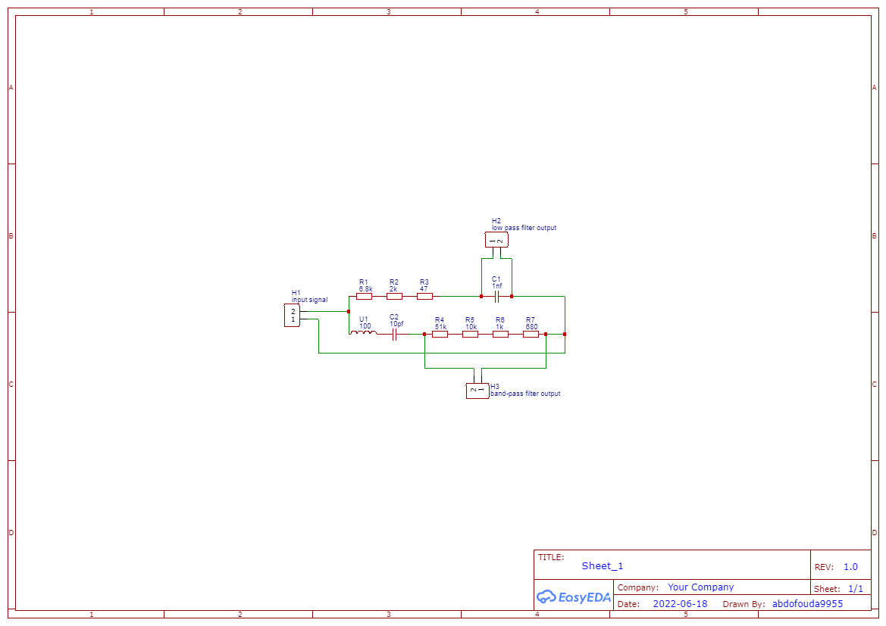
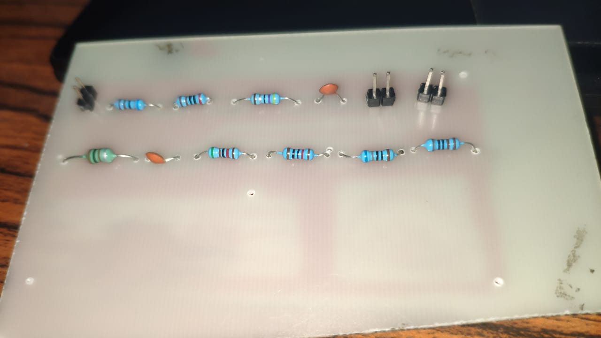
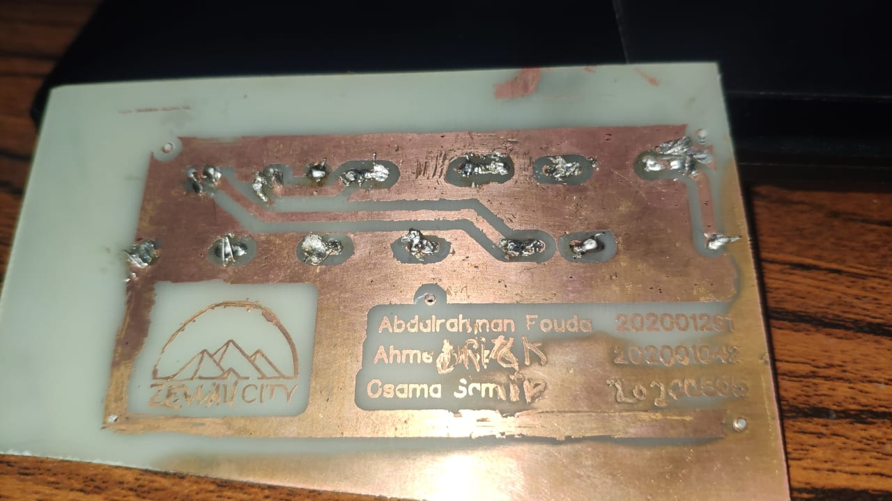

# Internet–Phone Filter Splitter

A passive ADSL splitter that separates voice and data bands using low-pass and band-pass filters, then carries the design from circuit analysis through simulation, breadboard validation, and PCB fabrication files.

## Design

- **Voice path:** RC low-pass filter designed for an approximately 18 kHz cutoff.
- **Data path:** RLC band-pass filter targeting the 256 kHz–100 MHz ADSL range.
- Simulated the filters in Proteus and compared the frequency response with the analytical transfer functions.
- Selected components and calculated PCB track requirements using IPC-2221 considerations.
- Produced an EasyEDA PCB layout and manufacturing-ready Gerber package.

## Hardware

| Front | Back |
|---|---|
|  |  |

## Repository contents

- [`Internet Phone Filter Splitter.pdf`](Internet%20Phone%20Filter%20Splitter.pdf) — design report and simulation results
- [`PCB_PCB_circuts_2022-06-20.json`](PCB_PCB_circuts_2022-06-20.json) — EasyEDA design source
- [`Gerber_PCB_circuts_2022-06-20.zip`](Gerber_PCB_circuts_2022-06-20.zip) — PCB manufacturing files
- [`Datasheet of the selected PCB components.docx`](Datasheet%20of%20the%20selected%20PCB%20components.docx) — selected-component references

## Technology

`Analog Filters` · `Proteus` · `EasyEDA` · `PCB Design` · `Circuit Analysis`

